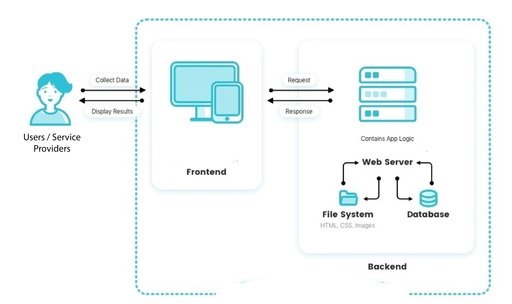

# Group_15_ServiceSphere

<b>Course</b>: Software Engineering  
<b>Institute</b>: Unviersity of North Texas  
<b>Semester</b>: Spring 2024  
<b>Team</b>: 
Mohammed Moinuddin Ansari
Uzair Naeem
Rinoj Gautam
Panduga Raja Tejasvi Prasad

# Introduction
# What is Service Sphere?
ServiceSphere is an app that bridges the gap between the person who wants to offer the service and the person who wants the service. This platform allows the professionally skilled people to market their services by creating their profile on this platform where users or customers can directly interact with them to avail the services offered by the professional. People who are new to a place often get troubled due to the unavailability of basic services around them. By using this app they can avail different types of services with ease.

# Architecture

# Installation
Install django on your local machine

`pip Install django`

go inside the directory of the project

`cd SE_project`

Run the below command to start the project

`python manage.py runserver`

If images are not loading

`python manage.py collectstatic`

You also might want to create an environment file before installing all the pacakges

`python -m venv "your environment name"`

Activate environment

`cd env/Scripts/activate`

# Demo
[Group 15 Service sphere demo](https://drive.google.com/file/d/1DWmbAlssI51a66Ksoxoc0qwRWSD_vlXQ/preview)

<video width="320" height="240" controls>
  <source src="Demo/Demo Group 15_serviceSphere.mp4" type="video/mp4">
  Your browser does not support the video tag.
</video>

